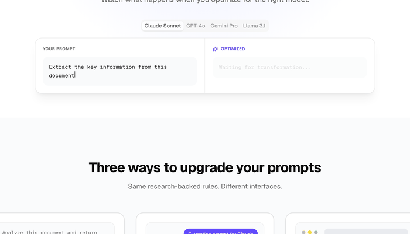

<p align="center">
  
</p>

<h1 align="center">Refrase</h1>

<p align="center">
  <strong>One prompt doesn't fit all models. Refrase fixes that.</strong>
  <br />
  <em>Restructures your prompts for the model you're actually using — backed by research across 46 models.</em>
</p>

<p align="center">
  <a href="https://refrase.cc/adapt"><strong>Try it live →</strong></a>
</p>

<p align="center">
  <a href="https://pypi.org/project/refrase/"></a>
  <a href="https://www.npmjs.com/package/refrase"></a>
  <a href="https://opensource.org/licenses/MIT"></a>
  <a href="https://github.com/craigcerto/fwip/actions/workflows/test.yml"></a>
  <a href="https://refrase.cc"></a>
</p>

<p align="center">
  <a href="https://refrase.cc">Website</a> · <a href="https://refrase.cc/adapt">Adapter</a> · <a href="https://refrase.cc/build">Prompt Builder</a> · <a href="https://refrase.cc/research">Research</a> · <a href="https://refrase.cc/docs/extension">Extension</a>
</p>

---

<!-- GIF demo goes here when ready -->
<!-- <p align="center"></p> -->

## What is Refrase?

Refrase is an open-source library that **restructures your prompts for the specific model you're targeting**. No LLM. No API calls. No latency. Just better prompts, instantly.

Every model processes prompts differently. Claude was trained on XML. Qwen3 needs thinking-mode prefixes. Magistral emits markers that break your JSON. We studied the official documentation from every major provider and ran a [46-model empirical evaluation](https://refrase.cc/research) to figure out exactly what each model needs — then put it in a library you can install in 10 seconds.

```bash
npm install refrase     # or: pip install refrase
```

## See It In Action

Same prompt. Three models. Three completely different optimizations.

**Your prompt:**
```
You are a senior code reviewer. Review the code for bugs and security issues. Return findings as JSON.
```

<table>
<tr>
<td><strong>Claude Sonnet</strong></td>
<td><strong>Qwen3 32B</strong></td>
<td><strong>Magistral</strong></td>
</tr>
<tr>
<td>

```xml
<role>
You are a senior code reviewer.
</role>

<instructions>
Review the code for bugs and
security issues. Return findings
as JSON.
</instructions>

<output_format>
Return structured output matching
the schema.
</output_format>
```

</td>
<td>

```
/no_think
You are a senior code reviewer.
Review the code for bugs and
security issues. Return findings
as JSON.

CRITICAL OUTPUT RULES:
- Your ENTIRE response must be a
  single valid JSON object.
- Do NOT include any text before
  or after the JSON.
...

IMPORTANT: All output must be in
English.
```

</td>
<td>

```
You are a senior code reviewer.
Review the code for bugs and
security issues. Return findings
as JSON.

CRITICAL OUTPUT RULES:
- Do NOT include any thinking,
  reasoning, or [THINK] blocks.
- Do NOT prefix your response
  with [TOOL_CALLS] or any
  markers.
...
```

</td>
</tr>
<tr>
<td>XML tags — Claude's native format (<a href="https://docs.anthropic.com/en/docs/build-with-claude/prompt-engineering/use-xml-tags">source</a>)</td>
<td>Thinking prefix + JSON lockdown + English enforcement (<a href="https://huggingface.co/Qwen/Qwen3-32B">source</a>)</td>
<td>Marker suppression — Magistral emits [THINK] and [TOOL_CALLS] that break parsing (<a href="https://docs.mistral.ai/capabilities/reasoning/native">source</a>)</td>
</tr>
</table>

<details>
<summary><strong>More examples: DeepSeek, Nemotron, Kimi, GLM...</strong></summary>

| Model | What Refrase does | Why |
|---|---|---|
| **DeepSeek V3** | Adds self-verification checklist | Tends to drop required fields ([docs](https://api-docs.deepseek.com/guides/json_mode)) |
| **Nemotron 9B** | `/think` prefix + simplified to 3 steps + strong JSON | Small model needs thinking mode + concise prompts |
| **Kimi K2** | Source grounding + English enforcement | K2 always reasons — needs explicit grounding. Multilingual model. |
| **GLM 4.7 Flash** | Simplified + nested object fix + English | Nested object serialization bug + bilingual model |
| **Llama 3.1 8B** | Simplified + grounding rules | Small model prone to hallucination |
| **MiniMax M2** | Contract-style self-verification | Responds well to explicit verification checklists |

</details>

## Quick Start

```typescript
import { adapt } from "refrase";

const result = adapt({
  prompt: "You are a data analyst. Extract key metrics from the quarterly report.",
  model: "claude-sonnet",
  task: "extraction",
});

result.system;   // → Adapted prompt (XML tags, thinking prefixes, etc.)
result.changes;  // → What changed and why, with evidence citations
result.apiHints; // → Recommended API params (temperature, max_tokens, etc.)
```

```python
import refrase

result = refrase.adapt(
    "You are a data analyst. Extract key metrics from the quarterly report.",
    model="claude-sonnet",
    task="extraction",
)
```

5 task types: `extraction` · `analysis` · `generation` · `code` · `general`

## Features

| | Feature | Description |
|---|---|---|
| 🔬 | **Research-backed** | Every rule traces to official docs or our 46-model benchmark. No guessing. |
| ⚡ | **Instant** | Deterministic transforms, no LLM calls. Under 1ms. |
| 🏷️ | **Honestly labeled** | Each change tagged `model_specific`, `best_practice`, or `compensation`. |
| 📋 | **API hints** | Tells you what API params to set (temperature, reasoning_effort, etc.) |
| 🔌 | **38 models** | 11 families: Claude, GPT, Gemini, Qwen, DeepSeek, Mistral, Llama, Kimi, GLM, Nemotron, MiniMax |
| 🧩 | **Extensible** | Add models by editing JSON. Register custom families at runtime. |
| 🌐 | **Cross-platform** | TypeScript + Python with identical output. Verified across 190 test cases. |
| 🖥️ | **MCP server** | Works in Claude Desktop, Cursor, and any MCP client. |

## Use It Everywhere

<table>
<tr>
<td width="50%">

### 💻 In your code

```bash
npm install refrase
# or
pip install refrase
```

[Full API docs →](#api)

</td>
<td width="50%">

### 🌐 On the web

**[refrase.cc/adapt](https://refrase.cc/adapt)** — paste, pick a model, see the result. No signup.

**[refrase.cc/build](https://refrase.cc/build)** — describe what you want in plain English. AI builds the optimal prompt.

</td>
</tr>
<tr>
<td>

### 🧩 In Claude Desktop / Cursor

```bash
npm install -g @refrase/mcp-server
```

```json
{
  "mcpServers": {
    "refrase": {
      "command": "refrase-mcp-server"
    }
  }
}
```

</td>
<td>

### 🧭 In your browser

Auto-detects ChatGPT, Claude, Gemini. Optimizes prompts in any text field.

<a href="https://refrase.cc/docs/extension">
  
</a>

</td>
</tr>
</table>

## 38 Models Supported

| Family | Provider | Models |
|---|---|---|
| **Claude** | Anthropic | Sonnet 4.6 · Opus 4.6 · Haiku 4.5 |
| **GPT** | OpenAI | GPT-4o · GPT-4o Mini · GPT-4 · o1 · o1 Mini · o3 · o3 Mini |
| **Gemini** | Google | 2.5 Pro · 2.5 Flash · Ultra |
| **Qwen** | Alibaba | 235B · 32B · 32B NoThink · Coder |
| **DeepSeek** | DeepSeek | V3 · V3.1 · V3.2 |
| **Mistral** | Mistral AI | Large · Magistral · Devstral · Ministral 3B/8B/14B |
| **Llama** | Meta | 3.1 405B/70B/8B · 3.2 3B |
| **Kimi** | Moonshot AI | K2 · K2.5 |
| **GLM** | Z.AI | 4.7 · 4.7 Flash |
| **Nemotron** | NVIDIA | 30B · 12B · 9B |
| **MiniMax** | MiniMax | M2 |

> **Adding a model = editing a JSON file.** No code changes. [See how →](CONTRIBUTING.md)

## The Research

We didn't guess at what works. We tested it.

- 📄 Read the official prompt engineering docs from **every provider** — Anthropic, OpenAI, Google, Meta, Alibaba, DeepSeek, Mistral, Moonshot, Z.AI, NVIDIA, MiniMax
- 🧪 Tested **46 model configurations** across **368 scenarios** with a production evaluation pipeline
- 👥 **Two independent judges** (Claude Sonnet + Haiku) with **Cohen's kappa = 0.94**
- 📊 Three scoring layers: service-specific quality (L1), universal rubric (L2), binary hiring decision (L3)

Every rule in this library has a verifiable source — an official doc URL or benchmark data.

**[Read the full methodology →](https://refrase.cc/research)**

## API

<details>
<summary><strong>Core: adapt() and listModels()</strong></summary>

```typescript
import { adapt, listModels } from "refrase";

const result = adapt({
  prompt: "Your system prompt",
  model: "claude-sonnet",
  task: "extraction",       // optional, default: "general"
  userPrompt: "User input", // optional
});

// result.system    → adapted system prompt
// result.user      → adapted user prompt (or null)
// result.changes   → [{ rule, description, evidence, impact, category }]
// result.apiHints  → [{ parameter, value, reason }] (or undefined)
// result.modelId   → "claude-sonnet"
// result.modelFamily → "claude"

const models = listModels();
// → [{ id, family, variant, name, provider }, ...]
```

</details>

<details>
<summary><strong>Explore: getModelConfig(), getFamilyConfig(), listFamilies()</strong></summary>

```typescript
import { getModelConfig, getFamilyConfig, listFamilies } from "refrase";

getModelConfig("claude-sonnet");
// → { name: "Claude Sonnet 4.6", variant: "sonnet", family: "claude", provider: "Anthropic" }

getFamilyConfig("claude");
// → { family, provider, docs_url, models: {...}, rules: [...], api_hints: [...] }

listFamilies();
// → [{ family: "claude", provider: "Anthropic", modelCount: 3, ruleCount: 2 }, ...]
```

</details>

<details>
<summary><strong>Extend: registerModel(), registerFamily()</strong></summary>

```typescript
import { registerModel, registerFamily } from "refrase";

// Add a fine-tune to an existing family (inherits all rules)
registerModel("claude", "claude-my-finetune", { name: "My Claude", variant: "sonnet" });

// Register a completely new family
registerFamily({
  family: "my-model",
  provider: "My Company",
  models: { "my-model-v1": { name: "My Model", variant: "default" } },
  rules: [{
    id: "my-rule", transform: "json_reinforce", target: "system",
    category: "best_practice", description: "JSON compliance",
    impact: "Reliable structured output",
    when: { variants: ["all"], tasks: ["all"] }, params: { tier: "standard" },
  }],
});
```

</details>

## How It Works

Config-driven. Every model's rules live in a JSON file, not code:

```json
{
  "family": "claude",
  "rules": [{
    "transform": "xml_wrap",
    "category": "model_specific",
    "evidence": {
      "source": "Claude is trained to follow XML-tagged instructions",
      "url": "https://docs.anthropic.com/en/docs/build-with-claude/prompt-engineering/use-xml-tags"
    }
  }]
}
```

14 composable transforms are mixed and matched per model. The engine reads the config, matches rules to your model + task, and applies transforms in sequence. Both TypeScript and Python read the same configs — verified identical across 190 model/task combinations.

## Contributing

Adding a model is just editing JSON. No code changes. See [CONTRIBUTING.md](CONTRIBUTING.md).

We also welcome new transforms, evidence citations, and benchmark data. Check [open issues](https://github.com/craigcerto/fwip/issues) for good first contributions.

## Star History

<!-- Replace with actual chart once we have stars -->
<!-- [](https://star-history.com/#craigcerto/fwip&Date) -->

If Refrase saves you time or makes your prompts better, **[give it a ⭐](https://github.com/craigcerto/fwip)**. It helps others find the project.

## License

[MIT](LICENSE) — use it however you want.
