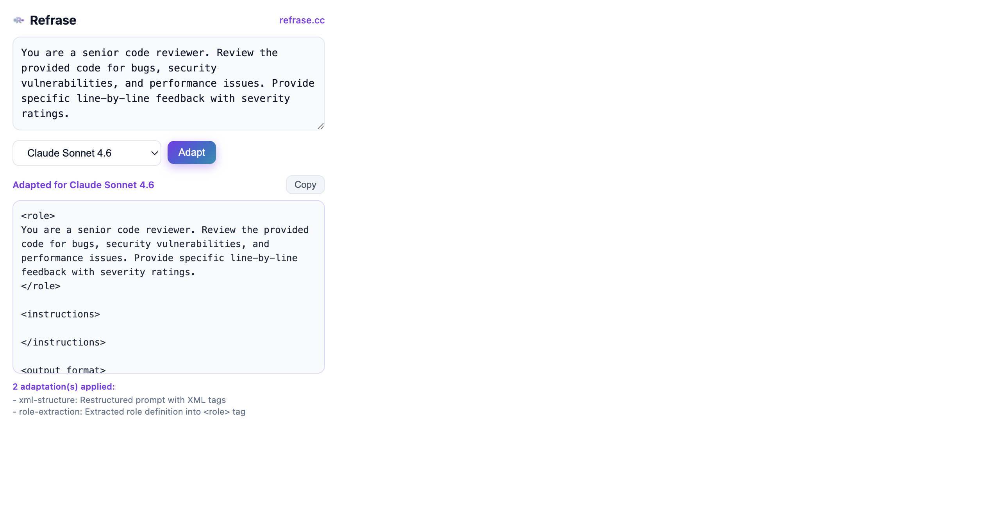
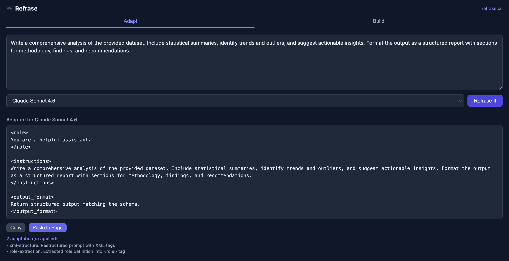

<h1 align="center">Refrase</h1>

<p align="center"><strong>Research-backed prompt optimization for every model.</strong></p>

<p align="center">
  <a href="https://refrase.cc">refrase.cc</a> &middot;
  <a href="https://refrase.cc/adapt">Try the Adapter</a> &middot;
  <a href="https://refrase.cc/build">Prompt Builder</a> &middot;
  <a href="https://refrase.cc/research">Research</a>
</p>

<p align="center">
  <a href="https://pypi.org/project/refrase/"></a>
  <a href="https://www.npmjs.com/package/refrase"></a>
  <a href="https://opensource.org/licenses/MIT"></a>
  <a href="https://github.com/craigcerto/fwip/actions/workflows/test.yml"></a>
</p>

---

We did the research first.

We tested **46 model configurations** across **368 scenarios** with dual-judge evaluation (**Cohen's kappa = 0.94**). We read the official prompt engineering documentation from every major model provider — Anthropic, OpenAI, Google, Meta, Alibaba, DeepSeek, Mistral, Moonshot, Z.AI, NVIDIA, MiniMax.

Then we built a library that applies what we proved works. **Deterministic. No LLM in the loop. Under 1ms.** Every adaptation rule traces to official documentation or our empirical data.

## The Problem

Most developers write one prompt and use it across every model. But models are trained differently:

| What you might not know | Source |
|---|---|
| Claude processes XML-tagged sections more reliably than plain text | [Anthropic docs](https://docs.anthropic.com/en/docs/build-with-claude/prompt-engineering/use-xml-tags) |
| Qwen3 requires non-greedy sampling — greedy decoding causes **endless repetition** | [Qwen3 model card](https://huggingface.co/Qwen/Qwen3-32B) |
| Gemini 3 **degrades** with temperature below 1.0 | [Google docs](https://ai.google.dev/gemini-api/docs/gemini-3) |
| Magistral emits `[TOOL_CALLS]` markers that break JSON parsing | [Mistral docs](https://docs.mistral.ai/capabilities/reasoning/native) |
| OpenAI's o-series models perform **worse** with "think step by step" prompts | [OpenAI docs](https://developers.openai.com/api/docs/guides/reasoning-best-practices) |
| DeepSeek JSON mode requires the literal word "json" in your prompt | [DeepSeek API docs](https://api-docs.deepseek.com/guides/json_mode) |

Refrase handles all of this automatically.

## Three Products, One Research Foundation

### 1. The Adapter (this library)

Deterministic, model-specific prompt optimization. Available as a TypeScript/Python library, an API, and an MCP server.

```typescript
import { adapt } from "refrase";

const result = adapt({
  prompt: "You are a senior code reviewer. Review the provided code for bugs, security vulnerabilities, and performance issues.",
  model: "claude-sonnet",
  task: "code",
});
```

**Before:**
```
You are a senior code reviewer. Review the provided code for bugs,
security vulnerabilities, and performance issues.
```

**After (Claude Sonnet):**
```xml
<role>
You are a senior code reviewer.
</role>

<instructions>
Review the provided code for bugs, security vulnerabilities, and performance issues.
</instructions>

<output_format>
Return structured output matching the schema.
</output_format>
```

The adapter also tells you what API parameters to set:

```javascript
result.apiHints
// [{ parameter: "max_tokens", value: 8192, reason: "Claude requires explicit max_tokens" }]

result.changes
// [{ rule: "claude-xml-wrap", category: "model_specific",
//    evidence: "Claude models are trained to follow XML-tagged instructions" }]
```

Every change is honestly labeled: `model_specific` (from provider docs), `best_practice` (general technique), or `compensation` (addresses a known weakness).

### 2. The [Prompt Builder](https://refrase.cc/build)

Most people know what they want to accomplish but struggle to articulate it as a prompt. The builder uses AI to extract your intent through smart follow-up questions, then generates the optimal prompt for your target model — validated by our research metrics.

### 3. The [Browser Extension](https://refrase.cc/docs/extension)

Optimize prompts right where you work — ChatGPT, Claude, Gemini, or any text field. Auto-detects which model you're using.

<p align="center">
  
</p>

<p align="center">
  
</p>

## Install

### TypeScript / JavaScript

```bash
npm install refrase
```

### Python

```bash
pip install refrase
```

### MCP Server (Claude Desktop, Cursor, etc.)

```bash
npm install -g @refrase/mcp-server
```

```json
{
  "mcpServers": {
    "refrase": { "command": "refrase-mcp-server" }
  }
}
```

> **Note:** npm/PyPI currently have v0.1.0. The config-driven v0.2.0 architecture is in this repo — install from source for the latest. Experiment data from the ongoing evaluation will replace mocked benchmarks soon.

## Usage

### Basic

```typescript
import { adapt } from "refrase";

const result = adapt({
  prompt: "Extract all employee records from this document.",
  model: "qwen3-32b",
  task: "extraction",
});

console.log(result.system);
// /no_think
// Extract all employee records from this document.
//
// CRITICAL OUTPUT RULES:
// - Your ENTIRE response must be a single valid JSON object.
// ...
//
// IMPORTANT: All output must be in English.

console.log(result.apiHints);
// [{ parameter: "temperature", value: 0.6, reason: "Greedy decoding causes endless repetitions" },
//  { parameter: "top_p", value: 0.95, reason: "Recommended for Qwen3 thinking mode" }]
```

### Python

```python
import refrase

result = refrase.adapt(
    "Extract all employee records from this document.",
    model="qwen3-32b",
    task="extraction",
)
print(result.system)
print(result.api_hints)
```

### Explore Models

```typescript
import { listModels, listFamilies, getModelConfig, getFamilyConfig } from "refrase";

// 38 models across 11 families
listModels();
// → [{ id: "claude-sonnet", name: "Claude Sonnet 4.6", family: "claude", provider: "Anthropic" }, ...]

// Family summary
listFamilies();
// → [{ family: "claude", provider: "Anthropic", modelCount: 3, ruleCount: 2 }, ...]

// Full model config with rules and evidence
getFamilyConfig("claude");
// → { rules: [{ id: "claude-xml-wrap", evidence: { url: "https://docs.anthropic.com/..." } }], ... }
```

### Add Your Own Models

```typescript
import { registerModel, registerFamily } from "refrase";

// Add a fine-tune to an existing family (inherits all rules)
registerModel("claude", "claude-my-finetune", {
  name: "My Fine-tuned Claude",
  variant: "sonnet",
});

// Register a completely new model family
registerFamily({
  family: "my-model",
  provider: "My Company",
  models: { "my-model-v1": { name: "My Model v1", variant: "default" } },
  rules: [{ id: "my-rule", transform: "json_reinforce", target: "system",
    category: "best_practice", description: "JSON compliance", impact: "Reliable structured output",
    when: { variants: ["all"], tasks: ["all"] }, params: { tier: "standard" } }],
});
```

## 38 Models, 11 Families

| Family | Provider | Models | What Refrase Does |
|---|---|---|---|
| **Claude** | Anthropic | Sonnet 4.6, Opus 4.6, Haiku 4.5 | XML structuring, role extraction, Haiku simplification |
| **OpenAI** | OpenAI | GPT-4o, GPT-4o Mini, GPT-4, o1, o1 Mini, o3, o3 Mini | Grounding rules, reasoning hints, `reasoning_effort` API hint |
| **Gemini** | Google | 2.5 Pro, 2.5 Flash, Ultra | `temperature: 1.0` API hint (degrades below) |
| **Qwen** | Alibaba | 235B, 32B, 32B NoThink, Coder | `/think` `/no_think` control, `temperature: 0.6` hint, English enforcement |
| **DeepSeek** | DeepSeek | V3, V3.1, V3.2 | Self-verification checklist, JSON reinforcement |
| **Mistral** | Mistral AI | Large, Magistral, Devstral, Ministral 3B/8B/14B | Marker suppression, type fixes, small model simplification |
| **Llama** | Meta | 3.1 405B/70B/8B, 3.2 3B | Grounding rules, small model simplification |
| **Kimi** | Moonshot AI | K2, K2.5 | Source grounding (K2), `temperature: 0.6` hint |
| **GLM** | Z.AI | 4.7, 4.7 Flash | Nested object fix, English enforcement |
| **Nemotron** | NVIDIA | 30B, 12B, 9B | Thinking mode, `reasoning_budget` hint, strong JSON for small |
| **MiniMax** | MiniMax | M2 | Self-verification |

## How It Works

Refrase is **config-driven**. Every model's behavior is defined in a JSON file, not code.

```
typescript/src/
├── configs/           # 11 JSON family configs ← SOURCE OF TRUTH
│   ├── claude.json    # Rules, evidence, API hints for Claude
│   ├── openai.json    # Rules for GPT-4o, o1, o3, etc.
│   ├── qwen.json      # /think prefixes, English enforcement
│   └── ...            # 11 families total
│
├── transforms/        # 14 composable pure functions
│   ├── xml_wrap       # Claude XML structuring
│   ├── thinking_prefix # Qwen/Nemotron /think control
│   ├── json_reinforce # Standard or strong JSON compliance
│   └── ...            # 14 transforms total
│
└── engine.ts          # Reads config → matches rules → applies transforms
```

Each config defines **models**, **rules** (with evidence), and **API hints**:

```json
{
  "family": "qwen",
  "provider": "Alibaba",
  "models": {
    "qwen3-32b": { "name": "Qwen3 32B", "variant": "32b" }
  },
  "rules": [
    {
      "id": "qwen-thinking-prefix",
      "transform": "thinking_prefix",
      "category": "model_specific",
      "when": { "variants": ["all"], "tasks": ["all"] },
      "params": { "task_map": { "extraction": "/no_think\n", "default": "/think\n" } },
      "evidence": {
        "source": "Qwen3 supports /think and /no_think reasoning toggles",
        "url": "https://huggingface.co/Qwen/Qwen3-32B"
      }
    }
  ],
  "api_hints": [
    { "parameter": "temperature", "value": 0.6,
      "reason": "Greedy decoding causes performance degradation and endless repetitions" }
  ]
}
```

**Adding a model = editing a JSON file.** No code changes. Both Python and TypeScript read the same configs.

## The Research

Our adaptation rules come from two sources:

**1. Official model documentation.** We read the prompt engineering guides, model cards, and API docs from every provider. When Anthropic says "use XML tags," when Google says "keep temperature at 1.0," when Qwen says "don't use greedy decoding" — those become rules with direct citations.

**2. Empirical evaluation.** We tested 46 model configurations across 368 scenarios using a production hiring pipeline (resume extraction + generation) with three scoring layers:
- **L1:** Service-specific quality criteria (extraction accuracy, schema compliance, etc.)
- **L2:** Universal 10-rule quality rubric (0-30 score)
- **L3:** Binary hiring decision (interview vs. reject)

Two independent judges (Claude Sonnet 4.6 + Haiku 4.5) scored every output. Inter-rater reliability: **Cohen's kappa = 0.94**.

Key findings:
- **Extraction is harder than generation** — 7-14 point quality gap across all models
- **Extended thinking improves quality but degrades structured output reliability** — 13% pass rate drop with full thinking enabled
- **Prompt adaptation is necessary for fair model comparison** — 8-10% quality improvement for adapted small models

Read the full methodology at **[refrase.cc/research](https://refrase.cc/research)**.

## Development

```bash
git clone https://github.com/craigcerto/fwip.git
cd fwip

# TypeScript
cd typescript && npm install && npm test   # 667 tests

# Python
cd python && pip install -e . && pytest    # 86 tests

# Cross-language parity
python tests/check-parity.py              # 190 checks

# Functional tests
npx tsx tests/functional-test.ts          # 63 checks
```

### Project Structure

```
fwip/
├── typescript/        # npm package: refrase
├── python/            # PyPI package: refrase
├── mcp-server/        # npm package: @refrase/mcp-server
├── tests/             # Cross-language parity + regression + functional
├── scripts/           # Config sync between TS ↔ Python
└── .github/workflows/ # CI: tests (Python 3.11-3.13 + Node 20), publish (npm + PyPI)
```

See [CONTRIBUTING.md](CONTRIBUTING.md) for how to add models (it's just editing JSON) and [CHANGELOG.md](CHANGELOG.md) for version history.

## License

MIT
